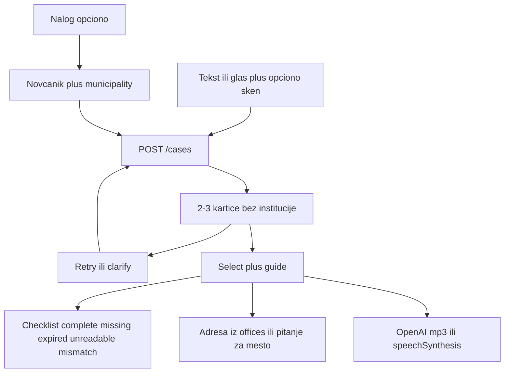

# NaŠalter — plan za preostali dan

**Ti = backend (FastAPI).** **Kolega = frontend (Next.js).**

**Ocena:** napredak je dovoljan za demo. Must-have tok (matching → kartice → vodič → adresa → checklist → TTS → nalog) već radi. Još jedan dan treba da **učvrsti scenu pred žirijem**, ne da otvara novu arhitekturu.

**Ugovor ostaje:** nije eUprava. Ne radimo e-potpis, podnošenje zahteva, zakazivanje, crawl, nearby MUP, četbot, Pirot-only katalog.

LLM ne piše ulicu. Adresa šaltera samo iz tabele `offices`. Checklist nije pravna overa originala.

---

## Šta je gotovo (Faze 0–5)

| Faza | Status |
|------|--------|
| 0 Temelj (repo, OpenAPI, seed, ekrani) | Gotovo |
| 1 Nalog i novčanik (gost sme matching + prilog) | Gotovo |
| 2 Matching (MUST) — kartice, retry, clarify, demo keš | Gotovo |
| 3 Vision + document-status | Gotovo |
| 4 Vodič i kancelarija (MUST) — Pirot→Beograd = Ljermontova 12a | Gotovo |
| 5 TTS OpenAI `gpt-4o-mini-tts` + `speechSynthesis` fallback; municipality na nalogu | Gotovo |
| 6 Demo skenovi, mapa, print | **Ostalo** |

TTS: `POST /cases/{id}/speech` → mp3. Tekst vodiča sa stranice/kataloga, ne iz LLM-a. Ako 503, FE čita glas pregledača.

Prioritet mesta za šalter: tekst (npr. Pirot→Beograd) **uvek** pobedi nalog. Inače `user.municipality`. Inače pitanje „U kom mestu ste?“ na vodiču.

---

## Pipeline



Demo rečenice koje **moraju** da rade tačno (prvi `POST /cases`, ne substring):

1. `istekla mi je lična`
2. `selim se iz Pirota u Beograd`

Gost sme matching + prilog uz case. Nalog = novčanik + opciono mesto.

---

## Rizici za žiri (nije rupa u MVP-u)

1. **Nema `demo/` sintetskih skenova** — scenario „istekla lična karta + Isteklo“ ne može pouzdano bez lažnog JPG-a.
2. **RFZO / APR / matičar** uvek imaju `office_missing` (samo 3 MUP šaltera). Ne demoovati te usluge ako pitch obećava adresu.
3. **Mikrofon** nema „Slušam…“ ni `onerror` — `frontend/components/DescribeBox.tsx`.
4. **Related** na vodiču nije klikabilan — `frontend/app/vodic/[caseId]/page.tsx`.
5. **`/vodic/{id}` bez `?slug=`** pada na `licna-karta-zamena`.
6. **`JSON.parse` sessionStorage** na predlozima može da sruši stranicu — `frontend/app/predlozi/[caseId]/page.tsx`.
7. **Clarify čuva stari tekst** — mesto na vodiču posle pitanja može da izgubi odgovore.
8. **Pomoć** ne spominje glas, TTS, upload, nalog — `frontend/app/pomoc/page.tsx`.
9. **`legal_excerpt`** stoji u katalogu, ali se ne prikazuje — propuštena prilika za „zašto prebivalište a ne boravište“.
10. Koordinate `lat`/`lng` postoje, mapa ne. Print ne postoji.

---

## Step-by-step: preostali dan

Redosled je namerno sečenje: prvo što može da sruši demo, pa vizuelni wow, pa extra.

### Korak 1 — sintetski skenovi i cheat-sheet (oboje) — BE urađen

Folder `demo/` (lažni podaci, krupan datum; u pitchu reći da je sintetika). Regeneracija: `backend/scripts/make_demo_scans.py`.

| Fajl | Namena | Očekivani status |
|------|--------|------------------|
| `demo/istekla-licna-karta.png` | gost + `istekla mi je lična` | **Isteklo** + važi do 2024-03-01 |
| `demo/necitko-sken.pdf` | isti tok, loš prilog | **Nečitko** (PDF, Vision se ne zove) |
| `demo/pasos.png` | mismatch | **Ne odgovara**, ne „Imate ličnu“ |

Cheat-sheet: `demo/README.md`. Kartice izlaze odmah (matching na tekst). Vision upisuje tip/rok posle uploada; FE crta `GET /document-status`.

Pre žirija, offline provera: `GET /health/llm` + jedan TTS + jedan Vision upload.

### Korak 2 — FE bagovi koji ruše tok (kolega)

- try/catch oko `sessionStorage` na predlozima
- nema default slug-a `licna-karta-zamena`; ako fali `slug`, vratiti na predloge
- indikator „Slušam…“ + `onerror` na mikrofonu
- „Nova pretraga“ da očisti `nasalter-case`
- link nazad na `/predlozi/{id}` sa vodiča
- ažurirati `frontend/app/pomoc/page.tsx`

### Korak 3 — mali BE/FE kontrakt — BE urađen

- `legal_excerpt` je u `GuideOut` (seed, nije LLM) i ulazi u TTS skriptu
- `related` ima `slug` + `title` (FE crta linkove `/vodic/{caseId}?slug=…`)
- Clarify: `CaseOut.text` uključuje odgovore; `raw_text` u bazi ostaje
- `municipality` na nalogu se normalizuje na `places.id` (nepoznato → 400)
- `GET /health/llm` javlja i OpenAI (Vision/TTS)
- ne širiti katalog kancelarija; ne dirati RFZO adrese

### Korak 4 — vizuelni plus (kolega, ako 1–3 drže)

- **Mapa:** `https://maps.google.com/?q={lat},{lng}` samo kad postoji `office`; pin na **istu** kancelariju, ne nearby. Ako `office_missing`, nema pin.
- **Štampa:** `window.print` + CSS `@media print` za korake + checklist + adresu (bez nav bara)

### Korak 5 — generalna proba (oboje)

Tri scene pred žirijem, pauza, disclaimer, TTS Stani, upload skena, Pirot→Beograd = Ljermontova 12a.

---

## Feature-i koji demo čine boljim

Raditi samo odozgo nadole. Donji redovi su „ako ostane sat“.

1. **Sintetski skenovi** — jedini način da Vision izgleda kao proizvod, ne kao mock.
2. **Maps link** — žiri vidi „gde da odem“ bez objašnjavanja adrese.
3. **Štampaj vodič** — papir na šalter, jak civic UX.
4. **Zašto ova procedura** (`legal_excerpt`) — odgovor na „kako znate da nije boravište“.
5. **Mikrofon feedback** — glas na unosu već postoji, ali izgleda pokvareno bez indikatora.
6. **Klikabilni related** — drugi hop u istom case-u.
7. **Pomoć + pitch kartica** na `/pomoc` — žiri često otvori to.
8. **Ne raditi:** deploy u oblak ako lokal radi; više opština; chatbot; eID; nearby; crawl; PDF generator umesto print.

---

## Scenariji pred žirijem (ne menjati)

1. `istekla mi je lična` + sken istekle lične karte → kartice → **Isteklo** + vodič + TTS. Ako nema grada: mesto na vodiču ili nalog.
2. `selim se iz Pirota u Beograd` → Ljermontova 12a (tekst pobedi nalog) + mapa ako stigne.
3. Nejasan unos → pitanja / „Nijedna nije to“.

**Pitch:** eUprava kad znaš ime usluge; mi iz namere i papira do nadležnog šaltera, bez eID-a.

---

## Šta ne dirati

- Demo keš u `backend/app/services/matching.py` (samo tačne rečenice, ne substring, ne retry/clarify)
- Office resolver (LLM ne vraća ulicu)
- Vision honesty (PDF/nečitko → `unreadable`, nije complete)
- AES-GCM, retention gosta (~48h)
- SQLite za demo; Postgres samo ako treba persistencija posle restarta na Renderu

---

## Pokretanje (lokalni demo)

Dva terminala:

```bash
cd backend && .venv\Scripts\activate && python -m uvicorn app.main:app --reload --port 8000
cd frontend && npm run dev
```

API: `http://localhost:8000` · UI: `http://localhost:3000`  
U `backend/.env`: `XAI_API_KEY`, `OPENAI_API_KEY`.
